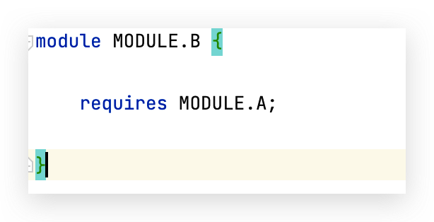

# 模块化

### 模块化

在Java 9以前很难真正的对代码进行封装，系统对不同JAR之间的依赖关系没有一个非常明确的概念。当你的项目引入一个JAR后，就能访问到该JAR的所有公共类。这样就很有可能导致针对代码的封装不够精细，在无意中使用了一个对方并不想公开访问的API。比如当你自己想写一个开源JAR包时，代码中包含一些内部使用的util类，需要被同一module但不同包的代码访问到只能将该类定义成public，但由于该类被定义成了public意味着其他任何使用你JAR包的人都能访问到该util类。

#### 目标

* 减少内存开销，仅加载必要的模块
* 更精细化的代码封装

#### 使用

模块由声明文件_module-info.java_组成，该文件需要放置在java代码结构的最顶层，在该文件中可以明确定义我们的模块需要依赖哪些模块，以及自身的哪些模块可以被外部引用，颗粒度细到具体的某一个包。

例子，共创建了两个模块：MODULE-A和MODULE-B，并在对应位置声明了_module-info.java_文件。

<figure><figcaption></figcaption></figure>

MODULE-B中的Person类想要访问MODULE-A里的Car类，按照之前的方式只需要在classpath中引入MODULE-A即可。

假设有这么一个需求，MODULE-A只希望Car类被外部访问，但CarPO类想保持私有，在Java 9之前的做法是CarPO需要和Car在同一个包下，且不能被定义为public。这显然极大提高了代码封装的复杂度，且类的存放结构不合理。

在Java 9中只需要做如下操作：

1. 在MODULE-A的_module-info.java_中使用_**exports**_关键字声明本模块中可以被外部访问的包。

<figure><figcaption>
MODULE-A module-info.java
</figcaption></figure>

&#x20;2\. 在MODULE-B的_module-info.java_中使用_**requires**_关键字声明依赖的模块。&#x20;

<figure><figcaption>
MODULE-B module-info.java
</figcaption></figure>

至此我们就实现了一个简单的模块封装、导出和依赖的流程，在MODULE-B中将能够顺利访问到MODULE-A里的Car类但无法访问CarPO类。
